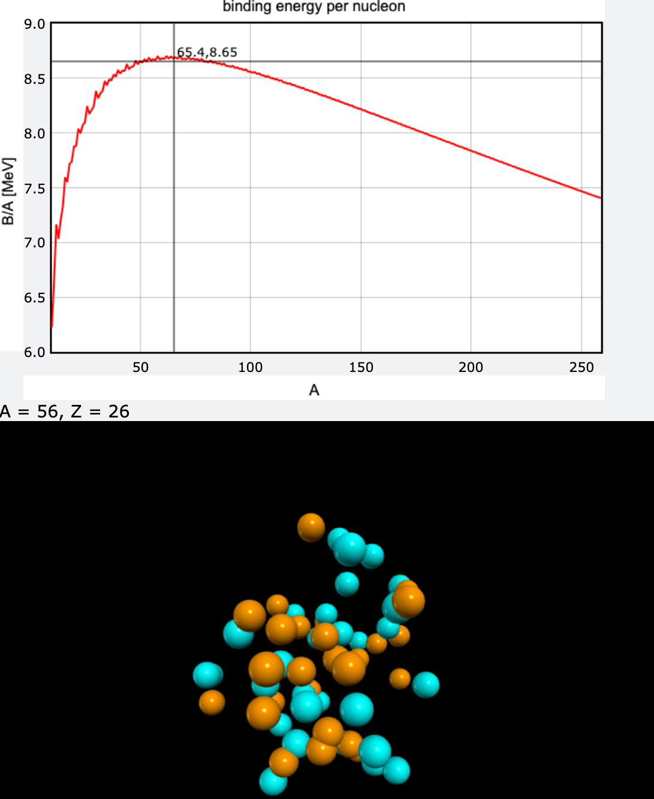

### Overview
- this is my solution for the semi-empirical mass formula problem by Newman (Exercise 2.9) 

$$

B = a_1 A - a_2 A^{\frac{2}{3}} - a_3 \frac{Z^2}{A^{\frac{1}{3}}} - a_4 \frac{(A-2Z)^2}{A} + \frac{a_5}{A^{\frac{1}{3}}}

$$ 
- where, in units of millions of electron volts, the constants are $a_1 = 15.8, a_2 = 18.3, a_3 = 0.714, a_4 = 23.2$

> this is a Screenshot from the simulation 
### Resources
[Computational Physics - Makr Newman, Exercise 2.9](https://www.amazon.de/s?k=Mark+Newman+%E2%80%93+Computational+Physics&i=stripbooks)
